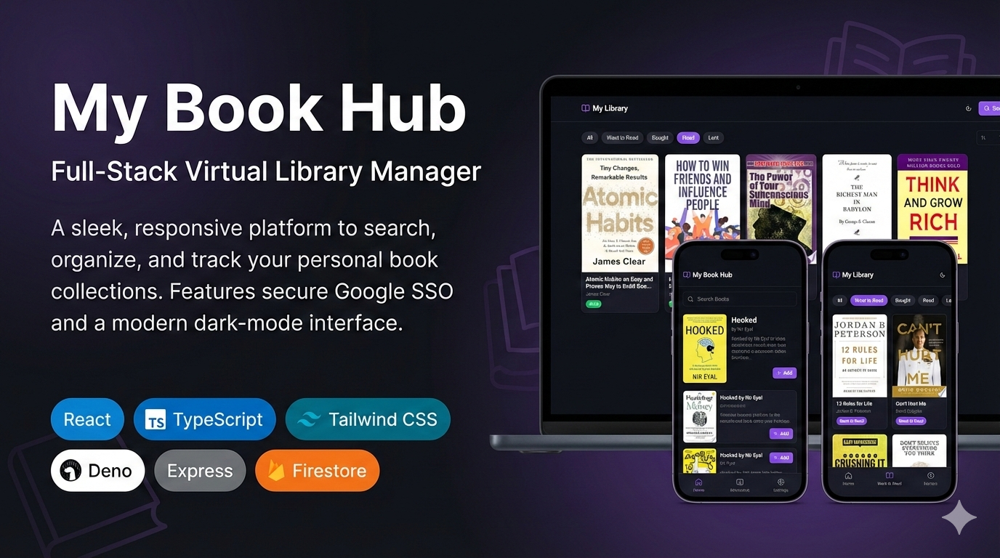

# My Book Hub



> A modern, personal Virtual Library Manager to search, organize, and track your
> book collection — all from your browser.

---

## ✨ Features

- **📚 Google Books Search** — Instantly search and discover books using the
  Google Books API.
- **➕ Add to Library** — Save books to your personal collection with a single
  click.
- **🏷️ Status Tracking** — Categorize each book as _Want to Read_, _Bought_,
  _Read_, or _Lent_.
- **🔍 Filter & Sort** — Filter your library by status and sort by title,
  author, or date added.
- **📖 Book Details** — View detailed information about any book in a sleek
  modal.
- **🌗 Dark / Light Mode** — Toggle between themes, or respect your system
  preference automatically.
- **📱 Progressive Web App (PWA)** — Install on your device for a native-like
  experience, with offline support.
- **🔐 Authentication** — Secure, user-specific libraries via SSO-backed
  authentication.

---

## 🛠️ Tech Stack

| Layer        | Technology                                                                   |
| ------------ | ---------------------------------------------------------------------------- |
| **Frontend** | [React](https://react.dev) · [TypeScript](https://www.typescriptlang.org)    |
| **Build**    | [Vite](https://vite.dev)                                                     |
| **Styling**  | [Tailwind CSS](https://tailwindcss.com) · [shadcn/ui](https://ui.shadcn.com) |
| **State**    | [TanStack React Query](https://tanstack.com/query)                           |
| **Routing**  | [React Router](https://reactrouter.com)                                      |
| **PWA**      | [vite-plugin-pwa](https://vite-pwa-org.netlify.app)                          |
| **Backend**  | Deno + Express API Gateway with Firebase Firestore                           |

---

## 🚀 Getting Started

### Prerequisites

- [Node.js](https://nodejs.org) (v18+) and npm (or [Bun](https://bun.sh))

### Installation

```bash
# 1. Clone the repository
git clone https://github.com/abhiparate14/my-book-hub.git

# 2. Navigate into the project
cd my-book-hub

# 3. Install dependencies
npm install

# 4. Create a .env file (see Environment Variables below)

# 5. Start the development server
npm run dev
```

The app will be available at **http://localhost:8080**.

### Environment Variables

Create a `.env` file in the project root:

```env
VITE_API_BASE_URL=<your-backend-api-url>
```

---

## 📁 Project Structure

```
my-book-hub/
├── public/                  # Static assets (icons, banner, PWA assets)
├── src/
│   ├── components/          # Reusable UI components (BookCard, BookModal, SearchPanel, etc.)
│   ├── context/             # React context providers (AuthContext)
│   ├── hooks/               # Custom React hooks
│   ├── lib/                 # API client & utility functions
│   ├── pages/               # Route-level page components
│   ├── test/                # Unit & integration tests
│   ├── types/               # TypeScript type definitions
│   ├── App.tsx              # Root application component
│   └── main.tsx             # Entry point
├── index.html               # HTML shell
├── vite.config.ts           # Vite configuration
├── tailwind.config.ts       # Tailwind CSS configuration
├── tsconfig.json            # TypeScript configuration
└── package.json
```

---

## 📜 Available Scripts

| Command              | Description                          |
| -------------------- | ------------------------------------ |
| `npm run dev`        | Start the development server         |
| `npm run build`      | Build for production                 |
| `npm run preview`    | Preview the production build locally |
| `npm run lint`       | Run ESLint                           |
| `npm run test`       | Run tests (Vitest)                   |
| `npm run test:watch` | Run tests in watch mode              |

---

## 📄 License

This project is open-source under the [MIT License](LICENSE).
